# 1. INTRODUCTION
Vietnamese high school students will have a national high school examinations in June 2025, and they would experience the innovation in these exams which are remarkably different from last years. 

I'm currently interested in finding what happened to national high school exams marks previous years and how it was changed.

# 2. DEFINE THE QUESTIONS TO ANSWER
- How is the growth of number of candidate each years? Does it show the positive educational environment
- Which subjects have the most and the least number of takers? Why?
- What is the distribution of marks in each subject?
- How marks in each subject change over years (do later student generation get smarter and have the higher marks)?
- Which block most students choose (Block A, Block A1, Block B, Block C, Block D)?
- Which cities have the highest candidates? How much percentage when it is compared to its population
- Which cities have the smartest students?
- Which cities have the remarkable improvement in marks of each subject
- Is there any correlation in marks among subjects?
- How many students in Vietnam could meet the entrance requirement of FTU HCM? 

# 3. DATA PREPROCESSING
Some data cleaning process conducted:
- Standardizing column names 

In the 2020-2021 dataset (df20_21), columns are renamed for consistency, such as 'SBD' to 'sbd', 'Toán' to 'toan', 'Ngữ Văn' to 'ngu_van', and 'Ngoại Ngữ' to 'ngoai_ngu', among others.

- Dropping Unnecessary Columns

The dataset df20_21 has columns deemed unnecessary for analysis, specifically 'ten' (name), 'ngay_sinh' (date of birth), and 'gioi_tinh' (gender), which are dropped to streamline the dataset. Additionally, the 'tinh' (province) column is removed after creating a separate table for city codes, reducing redundancy in the main dataset.

- Creating a City Code Table

A new table, df_code, is created by extracting unique pairs of 'code' and 'tinh' (province) from df20_21. 

- Filtering Foreign Language Data

For the 2023 and 2024 datasets (df23 and df24), rows are filtered to include only candidates who took the English exam (ma_ngoai_ngu = 'N1'), excluding those who took other foreign languages. Other languages accounts for only small quantity of dataset; therefore, I decided to remove these for better further analysis for the most common foreign language that students were chosen.

- Splitting the 2020-2021 Dataset

The combined df20_21 dataset is split into two separate DataFrames: df20 for 2020 data and df21 for 2021 data, based on the 'nam_thi' (exam year) column.

- Adding Year Columns to 2022-2024 Datasets

To maintain consistency with the 2020-2021 datasets, a 'nam_thi' (exam year) column is added to the 2022, 2023, and 2024 datasets (df22, df23, df24).

- Adding Province Code to 2023-2024 Datasets

A 'code' column is added to df23 and df24 to indicate the province of each candidate. I conducted through extracting first 1 or 2 digits from the 'sbd' (candidate ID) column to retrieve 'city code'.

# 4. EXPLORATORY DATA ANALYSIS (EDA)
## 4.1. Number of Candidates
### 4.1.1 The Trend of Candidate  Participating In The National High School Exam

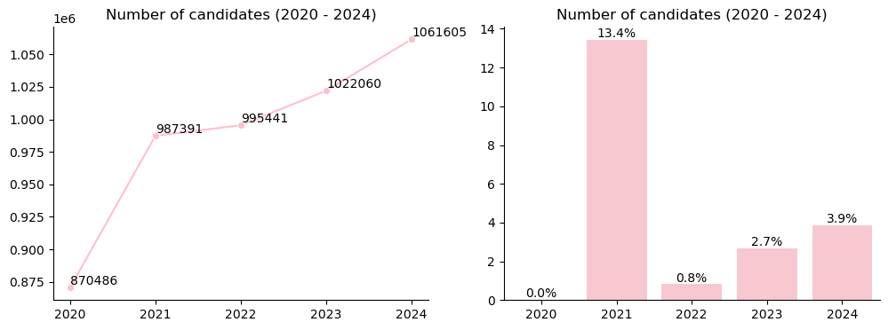
*Figure 1: Number of candidates over years

**Some reasons explain the increase in number of candidates each year:**

1. Mising information of Đà Nẵng city

In 2020, candidates' data of 1 city (Đà Nẵng) was missing (10.984 students according to [bocongan.gov](https://cdcsnd1.bocongan.gov.vn/home/giao-duc-dao-tao/tin-nganh-giao-duc/gan-11000-thi-sinh-o-da-nang-buoc-vao-ki-thi-dac-biet-4617)). It resulted from Đà Nẵng has experienced the outbreak of Covid-19 pandamic, all of students were postponed to attend first exams. And this was not recorded in this dataset. This missing data majorly explained the huge rise in 2021. 

2. The increase in birth rate from period of 2000 to 2005 

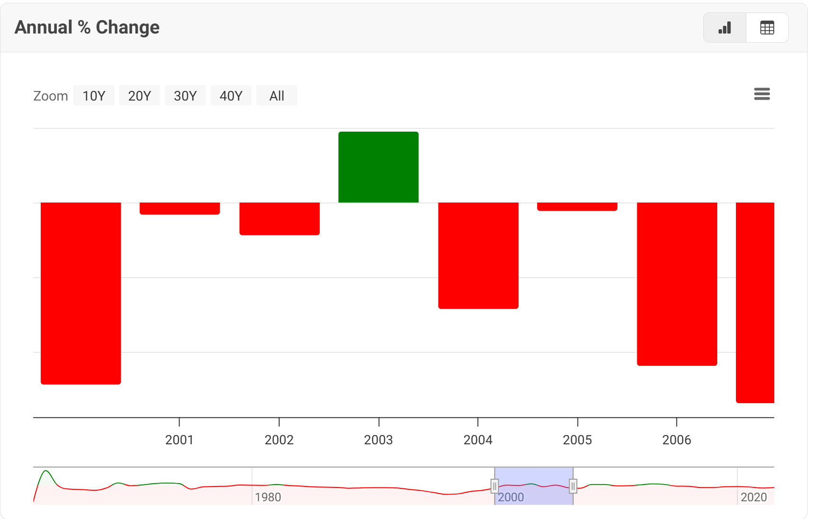
*Figure 2: VietNam Birth Rate (2000 - 2005) - Source: [MacroTrend](https://www.macrotrends.net/global-metrics/countries/vnm/vietnam/fertility-rate)*

As you can see from the graph, the annual % change of Vietnamese birth rate in 2003 could partially explain the significant increase in number of participants enrolled. In next following years, even though the decline in birth rate happened to Vietnam, the number of candidates still rose. This could be some other reasons 

3. Strong emphasis and widespread partipation in high school education in VietNam

Vietnam has a strong cultural tradition of education which is depicted as a straightforward path to future success. Attendence to national high school examination is widespread encouraged and also a primary method of college enrollment. 

4. The impact of Covid-19 pandamic

The Covid-19 pandemic, peaking in 2020–2021, likely disrupted education in Vietnam. From my perspectives, the number of candidates increases mainly due to the successful control over Covid-19 of Vietnamese government. 

In 2020, many people could not attend to the national examination, especially the positive for covid-19 and students living on the mountainous areas. This led to vast students delaying their exams in 2020 and majority of them decided to re-enter the national exams in next year.

### 4.1.2. The Trend of Candidate  Participating By Subject
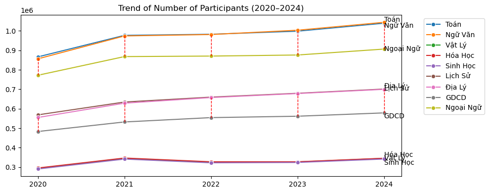
*Figure 3: Trend of number of participants (2000 - 2005)*

Overall, participants in most subjects has increased over the years, except for natural science subjects (Biology, Physics, Chemistry). Toán (Mathematics) and Ngữ văn (Literature) show the highest participation as these are mandatory subjects for students who want to graduate from high school. Though Foreign Language it was also a compulsory subject, the participants were not as high as maths and literature as the data in foreign language is only recorded for english. It is still a small number of other foreign languages (french, korean, japanese...)
are not included in this dataset.

Most Students were preferable to social science subjects rather than natural science subjects. This is explained by the amount of candidate of social science subjects were higher than those of natural subjects   

As I reaserched, even though participants had to do exams in their selected subject combination consecutively (Physics, Chemistry, Biology - natural science or History, Geography, Civics), the gap in participation between geography, history and civics was evident, as students educated at Continuing Education Centers only need to overcome 2/3 in social science, resulting in its consistently higher number of participants than civics.

## 4.2. Mark Analysis
### 4.2.1. The Glimpse Of Distribution of All Subjects Over Years
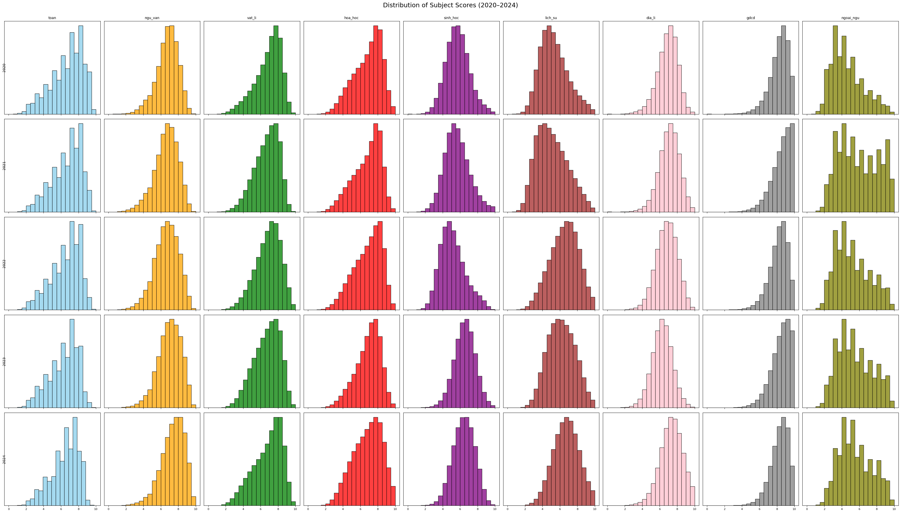
*Figure 4: distribution of all subjects over years (2020-2025)*

The natural science scores remained stable over years. Most of distributions were left-skewed, a good signal for education and normal distribution. The noticeable things on this graph were that civics had significantly high left-skewed distribution and english had bimodal distribution

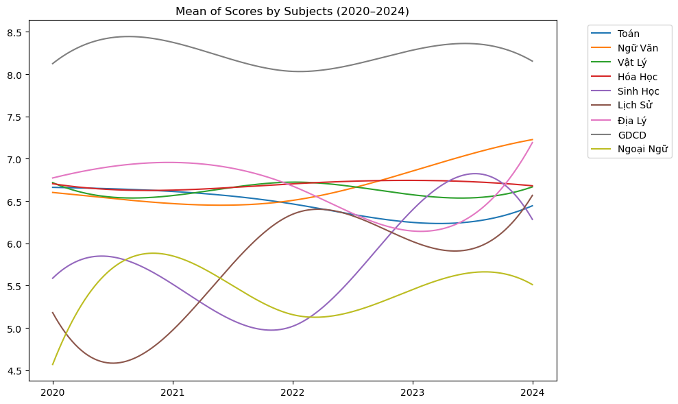
*Figure 5: Line graph of mean of score of all subjects over years (2020-2025)*

This line graph strengthened the above opinion about scores of natural science were less volatile than social science and the mean score of civics was exceptionally high compared to the rest of subjects.  

In this EDA, I will focus on analysis on compulsory subjects and subject groups (A00, D01..) which were commonly required for university entrance

### 4.2.2. Compulsory Subjects Analysis
**Overview**

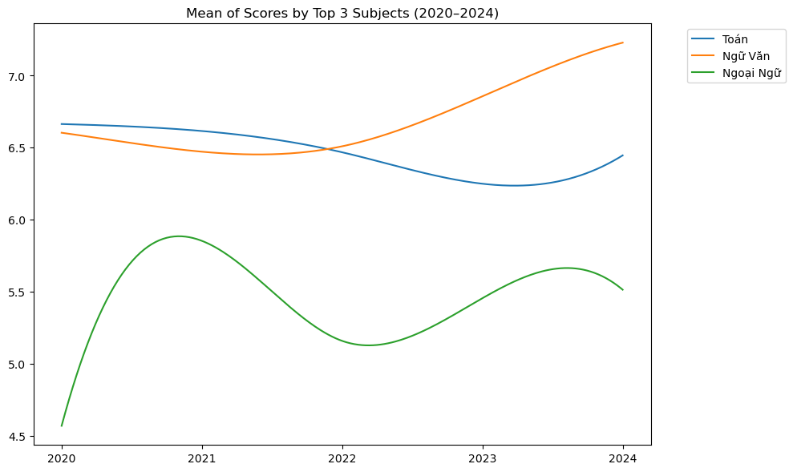
*Figure 6: Line graph of mean score of 3 compulsory subjects over years (2020-2025)*

Now, I emphasis analysis on my selected subjects. First, I could see that english mark  outstandingly lower, more fluctuated than others. Remarkably, it witnessed the huge rise in english mark in 2021 and drop moderately in following year. I would analyze the reasons for this unexpected highness later.  

Second, literature's mean score had the significant gain in 2023 and 2024. In contrast, average score in math saw the modest decrease in corresponding years.

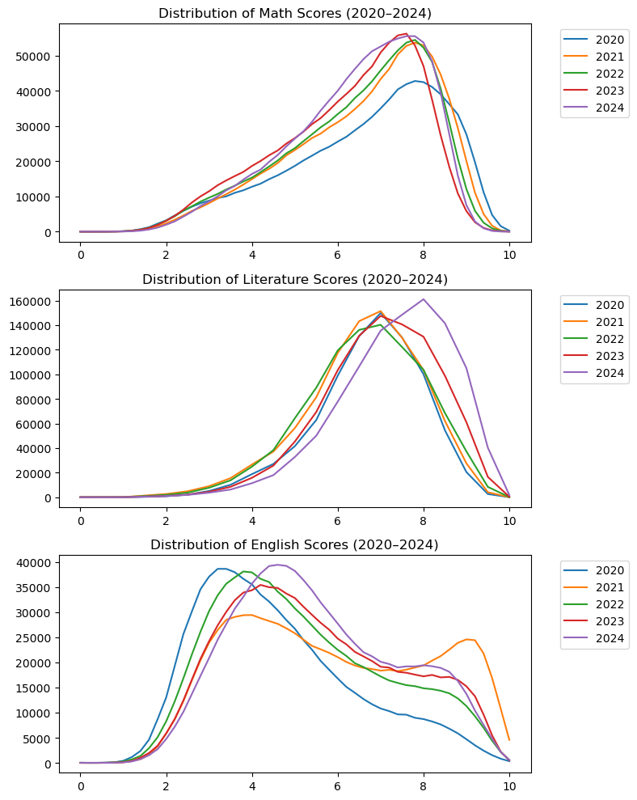
*Figure 7: KDE plot of 3 mandatory subjects by years (2020-2025)*

**Mathematics**

Increasing difficulty in fulfilling last 10 questions recent years:

- Due to the rising university admission standards, students becoming increasingly intelligent on maths and the exam questions were no longer as difficult and had become more predictable, scores in 2020 were high. 

- Recognizing this, the Ministry of Education increased the difficulty of questions targeting scores of 8 and above to better differentiate student abilities. As a result, in the following years, we see a clear decline in the scores of top performers (90th, 95th percentiles, etc.), although the average Math scores in 2021 and 2022 did not drop as significantly. This indicated that the Ministry of Education focused on distinguishing high-achieving students while keeping the same difficulty for vast candidates. 

- The difficulty of the Math exam continued to increase in 2023, affecting not only average candidates but also top performers. This resulted in the drop in both average scores and scores of > 90th. 

From my personal experience participating in the 2023 exam and reviewing previous exams, I found that the first 40 out of 50 questions were achievable with diligent preparation at school, but the remaining questions required a deep understanding of mathematics and complex applications to comprehend and solve.

**Literature**

The trend of score shifted to the right in 2 nearest years, this showed that candidates (both normal and top performers) obtain higher score . This could be explained by the examiners giving easier marks for candidates or the curriculum were easier and predictable by test-takers.

The average Literature score increased by approximately 0.4 points, but top performers (90th, 95th percentiles) only saw an increase of 0.25 points. The improvement is significant mainly for common score ranges (The most achievable range in 2024 is 7-8, those range in 2023 is 6.5-7) For higher score ranges, the increase is not substantial.
-> It is easier to achieve common scores (7-8), but reaching above 8.5 remains challenging.

**English**

We can observe a bimodal distribution in 2021, indicating a clear division between two groups of scores. This can be explained by the following factors:
1. The disparity in investment on education between urban and rural areas for English: Foreign language learning (English) is heavily influenced by external factors, as it requires long-term and consistent investment. Unlike other subjects that can be self-studied or practiced at home or school, foreign languages demand guidance from teachers and a high level of personal discipline. This makes it challenging to achieve high scores without significant investment, which is often lacking in rural areas.

2. The impact of COVID-19 widened the gap in foreign language proficiency between urban and rural areas: Children in remote or rural regions have limited exposure to English and face difficulties with online learning, leading to uneven foreign language scores.

3. The varying focus of students: Some students only aim to achieve the minimum required score in foreign language exams, while others prioritize it more for university admissions.

**Reasons for the Increase in Scores:**
1. The shift to online learning for foreign languages: This provided top performers with access to abundant knowledge resources. Top performers in foreign languages, who already had a strong foundation, benefited from online learning as a new opportunity to continue improving.

2. Reduction in curriculum demands to reduce the difficulty and burden of test-takers affected by COVID-19: The exam became easier, allowing top performers to achieve higher scores.

*Source: "As the Ministry of Education has also stated, the 2021 exam was designed to be less difficult than the sample exam. This is most evident in English, while math, physics, chemistry, and biology are considered to be equivalent or more difficult. The easy exam creates a comfortable mindset for candidates when taking the test, ending their 12 years of studying peacefully, in which the 11th and 12th grades were the last two years of schooling and had to endure the negative impacts of Covid-19."* - [VNExpress](https://cand.com.vn/giao-duc/Thi-tot-nghiep-THPT-2021-Pho-diem-mon-Tieng-Anh-co-bat-thuong-i621878/#:~:text=Theo%20d%E1%BB%AF%20li%E1%BB%87u%20c%E1%BB%A7a%20B%E1%BB%99,li%E1%BB%87t%20l%C3%A0%20144%20h%E1%BB%8Dc%20sinh.)  (English-translated)

**Key takeaways**

- It got harder to get the higher score (>8) of maths due to increase in difficulty.

- It is easier to achieve common scores (7-8), but reaching above 8.5 remains challenging in litererature.

- In 2021, English saw the wider disparities between gereral and attentive learners (rural and urban areas) due to Covid-19.

- Additionally, the exam content was reduced in 2021 leading to more students got top scores in english. 
## 4.3. Group Analysis
The exam subject groups commonly used in Vietnam's National High School Exam for university admissions:
- A00: Includes Math, Physics, and Chemistry
- A01: Includes Math, Physics, and English
- D01: Includes Math, Literature, and English 
- D07: Includes Math, Chemistry, and English

Among many blocks, I decided to select these to analyze because these are admission blocks of Foreign Trade University in Ho Chi Minh City. Therefore, I could answer the question why benchmark of FTU HCM was exceptionally high (~28/30). How many candidates are able to fulfill this benchmark. Is it reasonable or any hidden aspect happened.   

### 4.3.1. A00, A01, D01, D07 Group Analysis

**Findings**

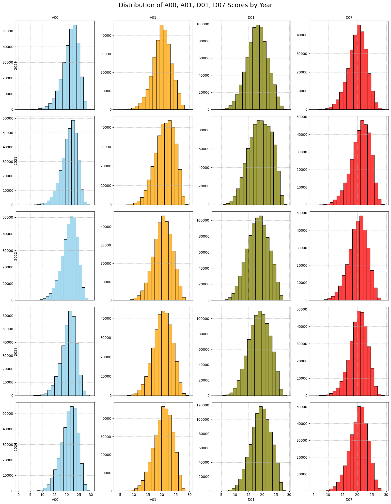
*Figure 8: Historgram of 4 groups by years (2020-2025)*

Overall, the distributions of A00 were stable over years. The 2021 distributions for A01, D01, D07 blocks, especially D01, show a wider spread with more low scores (below 15) than previous year all of them show a slight improvement (slight right) due to the increase in average english mark.

-> 2021 highlights the impact of COVID-19 on learning disparities, remarkably resulting from english

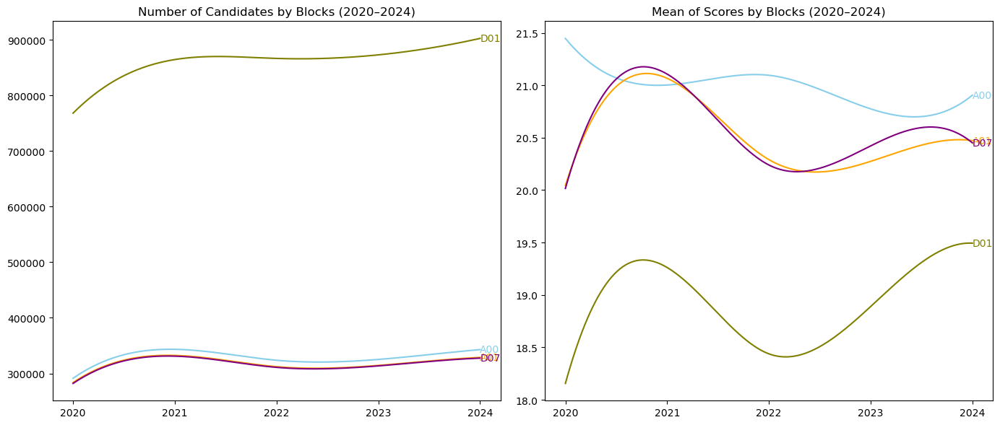
*Figure 9: Line graphs of number of candidate and average score by blocks (2020-2025)*

Mean score A01 and D01, D07 had relatively the same mean score trend because these include math and english in common. 

The increase in 2021 of A01 and D01 was due to the significant increase english (the subject for both blocks in common).

Increase in D01 in 2023 and 2024 resulted from increase in literature.

Meanwhile, A00 showed the stable trend in mean score, remaining the highest average score over years. This could be explained by candidates enrolling in this group had more preparation than others and all of 3 subjects in this group were examined on MCQs.

**Why D01 block is chosen by many students for the exam?**
- Because two out of the three subjects in this block (Math and Literature) are mandatory in the high school curriculum, so many candidates study them.
- The nature of Literature is relatively easier compared to other natural science subjects (it doesn’t strictly belong to either natural or social sciences), making this block a popular choice for university admissions.
- Unlike the natural or social science groups, where candidates can choose between the two, if candidates do not take the natural science group, they can opt for the social science group.

**Why does the D01 block have the lowest average score among all blocks?**
- In the D01 block, Literature is included, which is assessed through an essay format. The scoring depends on the examiner, it is subjective, and there’s correct or incorrect answers as in multiple-choice subjects.
- This block is often a "default choice" for candidates because it includes mandatory subjects like Math, Literature, and English. However, many candidates do not intend to use this block for university admissions, leading to a mix of students who are both interested and uninterested in this block. In contrast, blocks focused on natural or social sciences tend to attract candidates who are specifically interested in those fields, resulting in higher average scores.

**Conclusion**

The scores depend on subjective factors from the candidates (they must take the exam for this block even if it’s not their intended block for university admission, leading to a lack of thorough preparation, especially for Literature) and objective factors (mandatory subjects).

**Key takeaways**

- In 2021, it witnessed impact of COVID-19 on learning disparities, remarkably resulting from english

- D01 attract many examinees over years as it contains mandatory subjects 

- D01 got lowest mean scores over years because it had subjective grading from examiners and the blending of candidates interested and uninterested in D01. 
### 4.3.2. FTU HCM Benchmark Analysis
**Introduction**

The benchmark of FTU HCM over years (Economics major):

2024: 28.18 A00

2023: 27.6 A00

2022: 28.25 A00

2021: 28.55 A00

2020: 28.15 A00

A00, D01, D07 were lower than A00 0.5 in benchmark. For example, if you enroll in FTU HCM at D01 in 2024, you only need to satisfy 27.68/30. 

Relies on this benchmark, I would find out how much students could fulfill this tough requirements

**Findings**

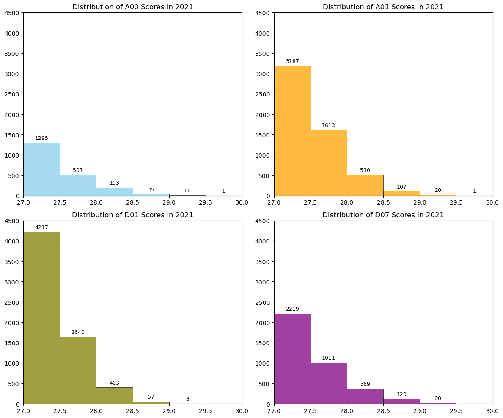
*Figure 12: Number of of Top Candidates (>27) by blocks in 2021*

The number of candidate fulfilling above 27/30 in A00, D01, D07 significantly gained in 2021. On the contrary, A00 showed the huge decline in high performance candidates

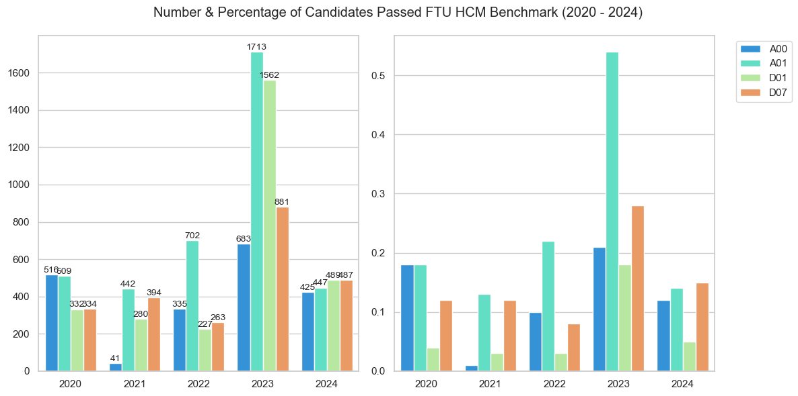
*Figure 11: Number and Percentage of Candidates Passing FTU HCM's Benchmark by blocks (2020-2025)*

FTU allocated 240 slots for the admission by national high school exam marks in 2021; however, in figure 11, only 41 candidates of A00 (top 0.01%) were able to achieve this score level, this situation seems quite unreasonable (without excluding candidates who might choose to study abroad or opt for other universities.)

After analysis, I noticed that the high scores were due to significant increases in other blocks (A01, D01, D07), as these blocks include English subjects where, as analyzed above, the number of top performers achieving high scores has increased in 2021. Not because number of top performers in A00 increased 

In the normal norms, A00 benchmark was 0.5 higher than those of other groups (A00, D01, D07). Therefore, the rise in other groups pushed the increasee in A00 even though not many students were able to cross the line. 

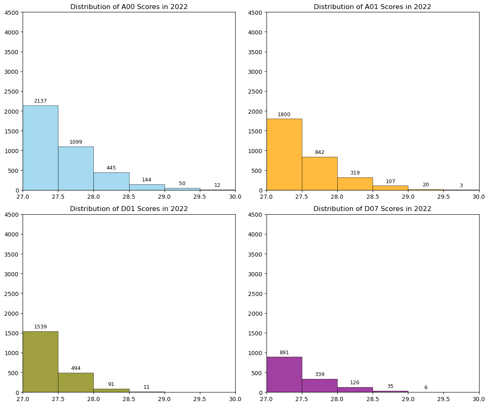
*Figure 12: Number of of Top Candidates (>27) by blocks in 2022*

Beyond 2021, the number of candidates achieving high scores (>= 27) has decreased in 2022 and risen slightly over following years, indicating an improvement in the quality of top-tier candidates across these blocks without affected by special event (Covid-19). 

However, FTU2’s benchmark scores have decreased dramatically in 2023 (A00: 27.6), which supports the argument that the school has lost its appeal to candidates in this year.

To further validate this, we should look into the benchmark scores of other economics-related universities like UEH, UEL, and RMIT. If the benchmark scores for programs at these two schools have increased, it would strengthen this conclusion.

After my searching, UEH's target for freshmen gained up to approximately 17.7% (6500 -> 7900), but the average of benchmark for all majors in UEH only decreased 3.3%. I concluded that FTU slightly lost their attraction from candidates and faced more competition of other universities on alluring top students. [UEH benchmark](https://docs.google.com/spreadsheets/d/1o08_mYcxbbpk0vAQDqW7DUm3uF5DV2QWX1j9m2wtExM/edit?usp=sharing) 

**Key takeaways**
- In 2021, only 0.01% of students enrolling by A00 fulfilled the benchmark. It is unreasonable.

- This abnormal things happened due to the rise in other groups (A01, D01, D07). 

- In 2023, FTU HCM didn't attract much top students applied by national high school exam marks in university admission.
## 4.4. City & Region Analysis

**Overview**

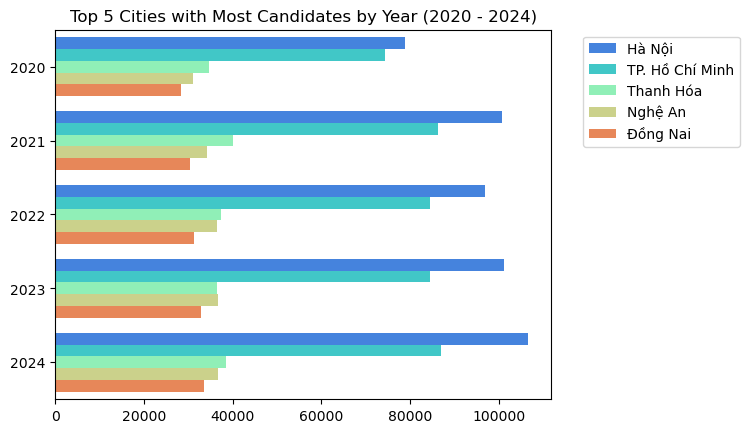
*Figure 13: Top 5 Cities With Most Candidates (2020-2024)*

The largest number of candidates is concentrated in Hanoi and Ho Chi Minh City, the two largest urban centers in the country. These accounted for more than twice the third largest number of candidates (Thanh Hoa)

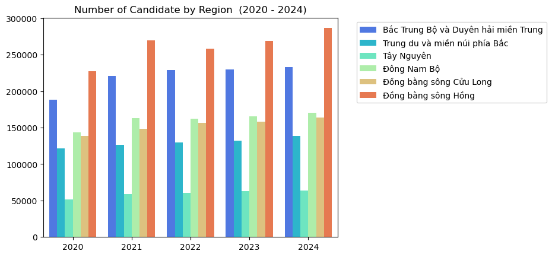
*Figure 14: Number of Candidates by Regions (2020-2024)*

However, regions in the North of Vietnam, such as the Red River Delta, North Central, and Central Coastal areas had the largest number of candidate enrolling.
### 4.4.1. Average Score By City
**Findings**

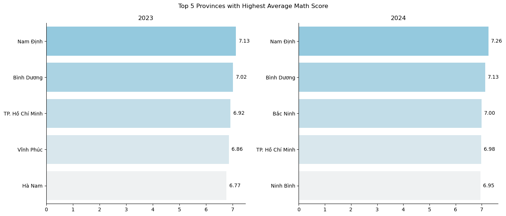
*Figure 15: Top 5 Cities With Highest Mean Score in Math (2023-2024)*

In Maths, Nam Dinh held the top position for the highest average Math scores over years. 

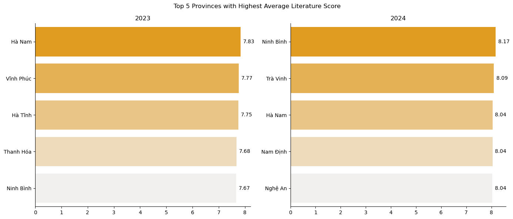
*Figure 16: Top 5 Cities With Highest Mean Score in Literature (2023-2024)*

The provinces with the highest average scores in Literature were all located in the North (either in the Red River Delta or North Central regions).

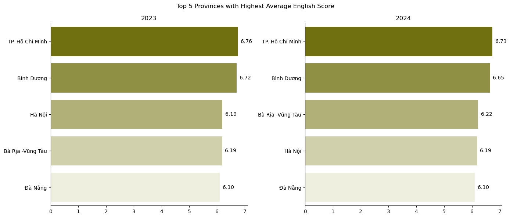
*Figure 17: Top 5 Cities With Highest Mean Score in English (2023-2024)*

For English, Ho Chi Minh City and Binh Duong have the highest average scores. This can be explained by the fact that these areas host many companies with foreign investment and high GDP per capita, providing candidates with better conditions and greater family emphasis on English education from an early age.

### 4.4.2. FTU HCM Benchmark By City
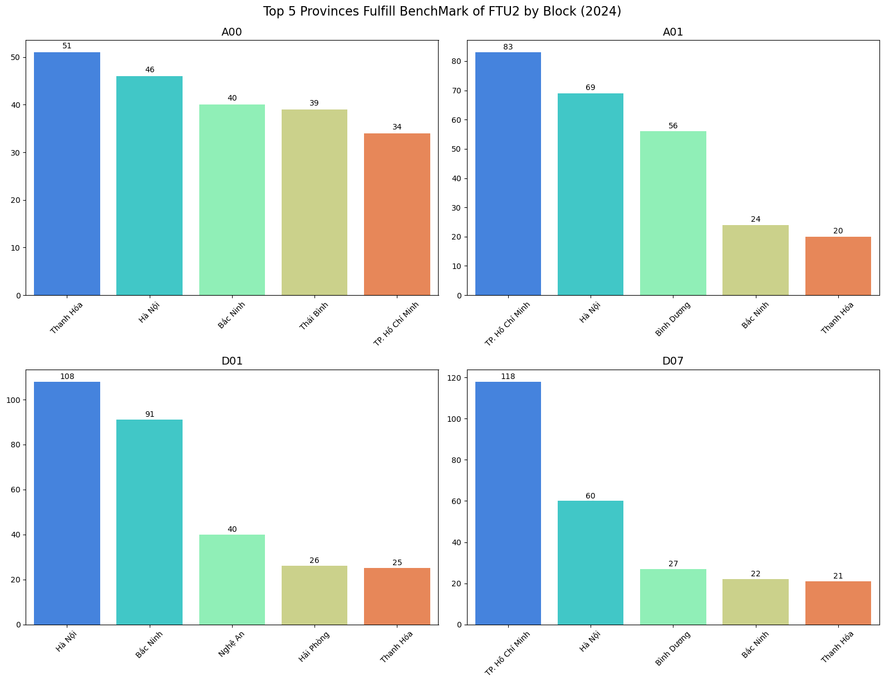
*Figure 18: Top 5 Cities Fulfilling FTUHCM's Benchmark in 2024*

Over the years and latest exam year (figure 18), Hanoi and Ho Chi Minh City have consistently been the two locations with the highest number of candidates meeting the benchmark scores for university admission to FTU2. This is understandable, as these are two key regions of Vietnam with large number of candidates. Therefore, candidates could immerse in the best educational condition from exceptional teachers. Consequently, it is more likely for them to have a higher number of high-achieving students reaching these scores compared to other provinces or cities.

-> It is high likelihood that FTUer attracted talents from these 2 cities. 

Northern provinces, particularly from the Red River Delta (e.g., Hà Nội, Bắc Ninh, Thái Bình, Nam Định), dominate the rankings for A00 (Math, Physics, Chemistry) and D01 (Math, Literature, English) across all years. This aligns with the previous findings that Northern cities focused on maths, literature (mandatory subjects).

Hanoi constantly trained the top students over years in all 4 groups and; therefore, many examinees were qualified to enroll in FTU HCM.

On the other hand, Southern provinces, particularly Ho Chi Minh City and Bình Dương, consistently rank high for A01 (Math, Physics, English) and D07 (Math, Chemistry, English), especially, Ho Chi Minh City had many top performers in A01, D07.